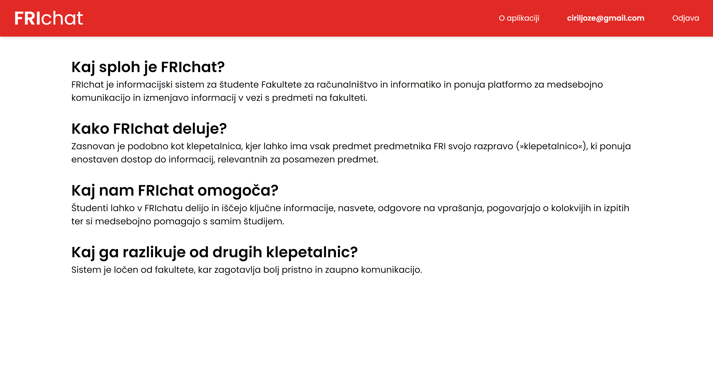
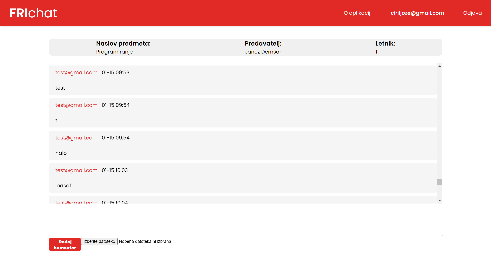
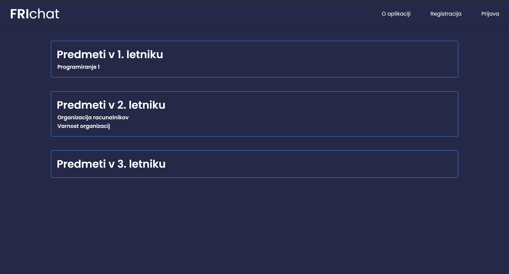
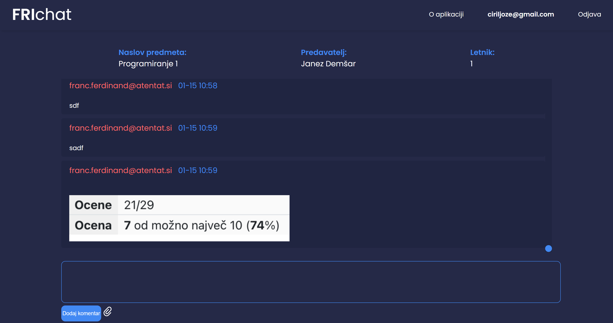
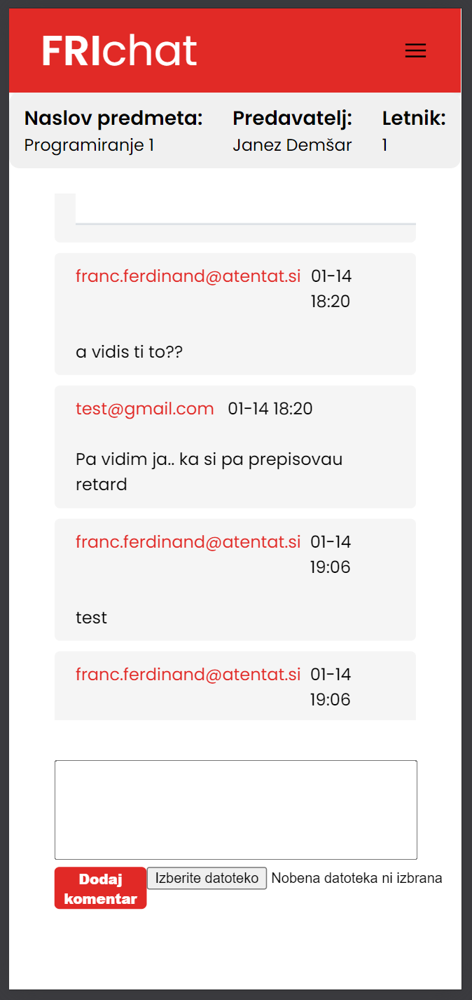

# Informacijski sistem FRIchat

## Člana ekipe:
- 63230023 Luka Božič
- 63230176 Bernard Kužnik

FRIchat je informacijski sistem za študente Fakultete za računalništvo in informatiko in ponuja platformo za medsebojno komunikacijo in izmenjavo informacij v vezi s predmeti na fakulteti. Zasnovan je podobno kot forum oz. pogovorna aplikacija (npr. Discord), kjer ima vsak predmet predmetnika FRI svojo klepetalnico (chat room), kar ponuja enostaven dostop do informacij, relevantnih za posamezen predmet. Študenti lahko v FRIchatu delijo in iščejo ključne informacije, nasvete, odgovore na vprašanja, pogovarjajo o kolokvijih in izpitih ter si medsebojno pomagajo s samim študijem. Sistem je ločen od fakultete, kar zagotavlja bolj pristno in zaupno komunikacijo.

## Opis delovanja sistema:
Do sistema je možno dostopati bodisi anonimno bodisi z uporabniškim računom.

V primeru anonimnega dostopa je funkcionalnost omejena. Uporabniki lahko berejo sporočila iz klepetalnic, vendar ne morejo aktivno sodelovati v klepetu.

Če se odločimo za dostop z uporabniškim računom, se moramo najprej prijaviti oziroma registrirati. Po uspešni overitvi lahko dostopamo do klepetalnic, ki so ustvarjene za različne predmete.

Ko vstopimo v klepetalnico, lahko neomejeno komuniciramo z drugimi uporabniki. Omogočeno je postavljanje vprašanj, odgovarjanje ter pošiljanje različnih vsebin, kot so slike in zapiski. Prav tako imamo na voljo stran za ogled in spreminjanje uporabniških informacij.

## Opis nalog:
- **Bernard** je odgovoren za razvoj backend storitve. To vključuje zasnovo strežniškega dela sistema in upravljanje z bazo podatkov.
- **Luka** je odgovoren za razvoj frontend storitve, kjer je zasnoval uporabniški vmesnik. To vključuje oblikovanje spletne strani ter integracijo z backend sistemom.
- Seveda sva pri kozultiranjem sodelovala drug z drugim.

## Svetla in temna tema:

## Responsive dizajn:

